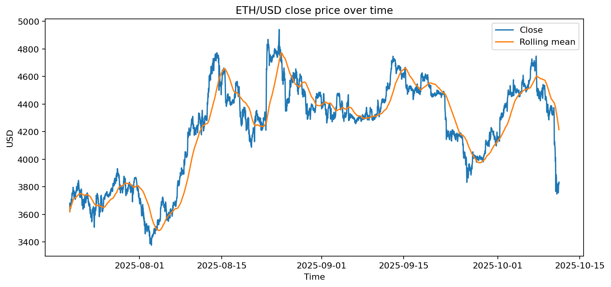
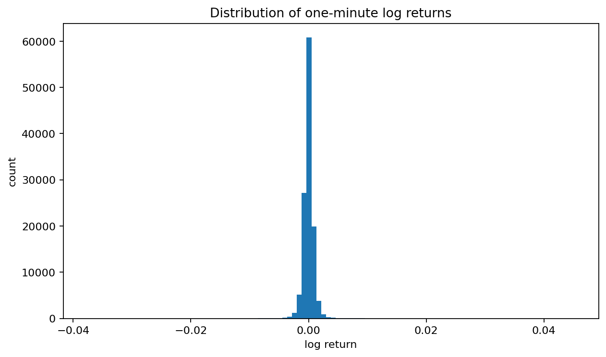
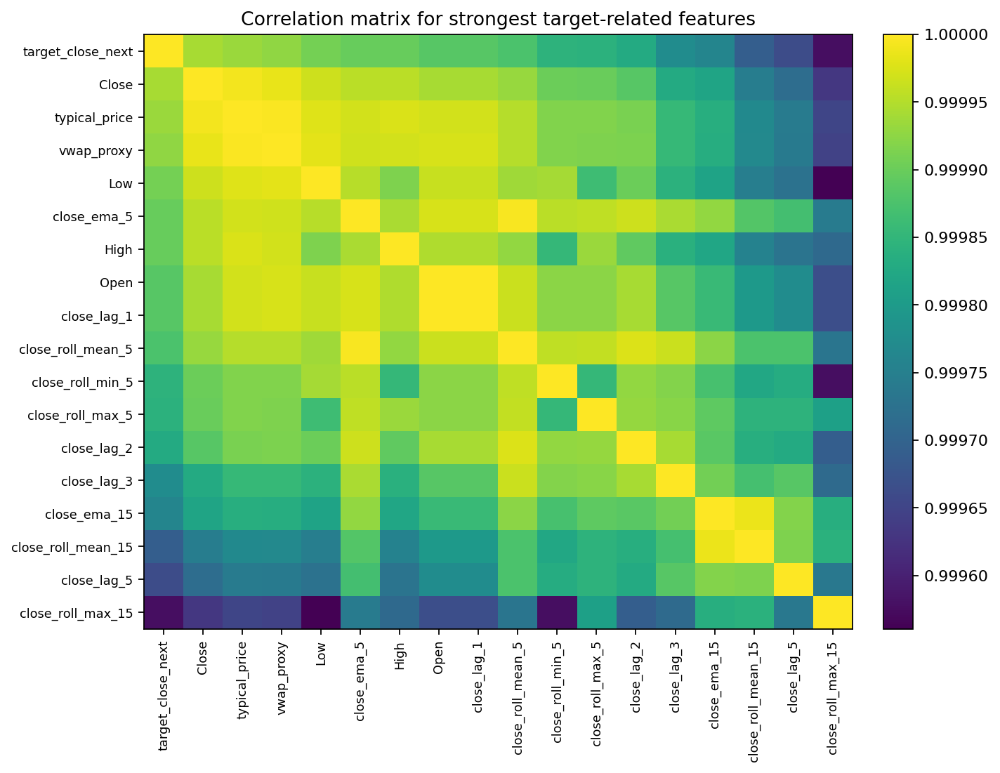
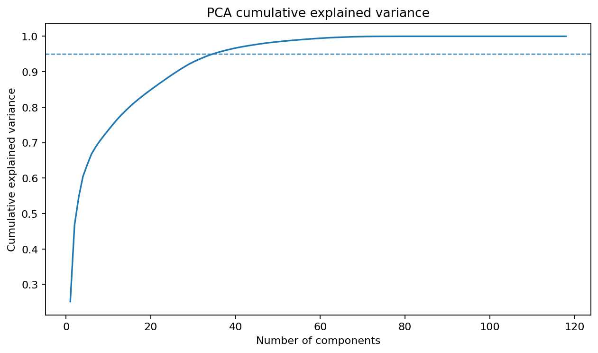

# 1. Постановка задачи

Цель проекта - предсказать цену закрытия Ethereum к доллару США на следующей минуте по минутным OHLCV-свечам. Это задача регрессии временного ряда: по информации, доступной на момент `t`, строится прогноз `Close(t+1)`.

Основная метрика - **MAE**. Она измеряется в долларах и напрямую показывает среднюю абсолютную ошибку прогноза. Дополнительно считаются RMSE и R2. Для выбора модели использовался validation split, test split использовался только для финальной оценки.

Важно: это учебная ML-задача, а не торговая рекомендация. Модель не учитывает комиссии, спреды, проскальзывание, новости и изменение рыночного режима.

# 2. Данные

В CP2-прогоне использован файл `data/sample/ethusd_1m_sample.csv`. Факты из `report/dataset_description.json`:

- строк: 120000;
- колонок после удаления служебных полей: 10;
- период: с `2025-07-20 03:05:00` по `2025-10-11 11:04:00`;
- пропуски во всех используемых колонках: 0.

Использованные исходные колонки: `Open time`, `Open`, `High`, `Low`, `Close`, `Volume`, `Quote asset volume`, `Number of trades`, `Taker buy base asset volume`, `Taker buy quote asset volume`.

Для самостоятельного получения данных добавлен скрипт `scripts/download_binance_klines.py`. В локальном контрольном запуске из логов он сохранил 121 строку в `data/raw/ethusdt_1m_binance_api_check.csv` за период `2025-01-01 00:00:00` - `2025-01-01 02:00:00`. Основные эксперименты ниже проводились не на этом маленьком API-чеке, а на sample из 120000 строк.

# 3. Очистка данных и выбросы

Очистка реализована в `src/eth_price/data.py`. По `report/cleaning_report.json` для CP2-прогона:

- bad timestamps: 0;
- дубликаты timestamp: 0;
- строки с некорректной OHLCV-логикой: 0;
- разрывы временного ряда не по 1 минуте: 0;
- строк после очистки: 120000.

Отдельно проверялись экстремальные минутные log-return. По `report/outlier_report.json` найдено 186 наблюдений с порогом `z_threshold = 6.0`, доля - 0.001550, максимальный абсолютный log-return - 0.045160.

Эти наблюдения не удалялись автоматически, потому что для криптовалют резкие минутные движения могут быть реальными рыночными событиями. Автоматически удаляются только физически невозможные записи: отрицательные цены/объёмы, нарушение `Low <= Open/Close <= High`, плохие timestamps и дубликаты. Распределительные выбросы обрабатываются внутри sklearn-pipeline через `QuantileClipper`, который обучается только на train split.

# 4. Feature engineering и защита от data leakage

После feature engineering осталось 119938 строк и 118 признаков. Добавлены candle-признаки, торговые отношения, лаги цены/объёма/сделок/доходности, rolling-признаки по окнам 5/15/30/60 минут, EMA, RSI-14 и временные признаки.

Data leakage контролируется так:

1. Split хронологический: train, затем validation, затем test. Перемешивания нет.
2. Target создаётся как `Close(t+1)` через `shift(-1)` и не входит в признаки.
3. Лаговые и rolling-признаки используют только текущее или прошлое значение на момент `t`.
4. Препроцессинг и подбор параметров выполняются на train/validation. Test используется только один раз для финальной оценки.

# 5. Визуализации и выводы



Цена меняется плавно относительно горизонта 1 минута. Поэтому текущая цена `Close(t)` является сильным baseline для прогноза `Close(t+1)`.



Большая часть минутных доходностей около нуля, но есть хвосты. Из-за этого RMSE чувствителен к редким крупным движениям, а MAE удобнее как основная метрика средней ошибки.



Самые сильные связи с target имеют текущие и лаговые ценовые признаки. Это ожидаемо для короткого горизонта и объясняет, почему сложные модели не обязаны сильно обгонять naive baseline.



PCA показывает сильную избыточность признаков: многие лаги и rolling-признаки коррелируют между собой. Поэтому в эксперименты добавлена модель `Ridge+PCA95`.

# 6. Эксперименты

Использовались два baseline:

1. `Baseline LinearRegression without FE` - линейная регрессия на исходных OHLCV-признаках без feature engineering.
2. `Naive close(t)` - прогноз `Close(t+1) = Close(t)`. Для минутных финансовых данных это обязательный сильный baseline.

Каждый эксперимент запускался на одинаковом хронологическом split. Подбор гиперпараметров выполнялся по validation MAE без доступа к test. Полная таблица экспериментов сохранена в `report/experiment_results.csv`, полный лог перебора параметров - в `report/hyperparameter_search_details.csv`.

| Model | Val MAE | Test MAE | Test RMSE | Короткий вывод |
|---|---:|---:|---:|---|
| Baseline LinearRegression without FE | 1.8759 | 2.3501 | 4.4084 | baseline без FE |
| Weighted blend: naive + Ridge | 1.8766 | 2.3469 | 4.3796 | лучший RMSE, финальный ансамбль |
| Naive close(t) | 1.8767 | 2.3458 | 4.3833 | лучший MAE |
| Ridge | 1.8877 | 2.4123 | 4.8587 | лучшая ML-модель внутри blend |
| ElasticNet | 1.8888 | 2.3910 | 4.7675 | близко к линейным моделям |
| LinearRegression | 1.8893 | 2.3922 | 4.7594 | FE не дал сильного выигрыша |
| Ridge+PCA95 | 2.0069 | 2.5646 | 5.5623 | PCA ухудшил качество |
| RandomForest | 2.6785 | 2.7207 | 4.6479 | хуже линейных моделей |
| ExtraTrees | 2.7043 | 2.8806 | 5.5024 | хуже линейных моделей |

Перебор параметров был выполнен для Ridge (`alpha`: 0.1, 1.0, 10.0, 50.0), ElasticNet (`alpha`: 0.0001/0.001 при `l1_ratio=0.2`), Ridge+PCA95 (`alpha`: 0.1, 1.0, 10.0). Для RandomForest и ExtraTrees использовалась ограниченная конфигурация `n_estimators=10`, `max_depth=8`, `min_samples_leaf=5`, чтобы эксперимент был воспроизводимым на минутных данных.

# 7. Финальная модель CP2 и честная интерпретация результата

По test MAE лучший результат показал `Naive close(t)`: `test_mae = 2.3458`. Это означает, что на горизонте 1 минута простая инерционная модель очень сильна.

`Weighted blend: naive + Ridge` получил `test_mae = 2.3469`, то есть по MAE он немного хуже naive baseline. При этом он получил лучший `test_rmse = 4.3796` против `4.3833` у naive baseline. Улучшение RMSE очень маленькое, примерно 0.084%.

Поэтому честный вывод такой: сложные ML-модели в этом CP2-прогоне не дали существенного улучшения над naive baseline. В качестве финальной CP2-модели можно оставить weighted blend, потому что он является ансамблем, использует ML-поправку Ridge и слегка снижает RMSE. Но в отчёте нельзя утверждать, что ML существенно превзошёл baseline.

# 8. Качество кода и воспроизводимость

В архиве есть `pyproject.toml`, `requirements.txt`, fixed seed `SEED = 812742`, Dockerfile, docker-compose, тесты, модульная структура `src/eth_price/`, скрипт обучения `scripts/train.py` и скрипт самостоятельного парсинга `scripts/download_binance_klines.py`.

Проверки, выполненные при сборке этого CP2-архива:

```bash
ruff check .
ruff format --check .
PYTHONPATH=src pytest -q
```

Результат: ruff проходит, `pytest` - 4 passed.

# 9. Итог CP2

Что реально закрыто в CP2: проверка выбросов, объяснение защиты от data leakage, самостоятельный парсер Binance API, 5+ моделей, ансамбль `Weighted blend: naive + Ridge`, перебор гиперпараметров, PCA-эксперимент, линтер, Dockerfile/docker-compose и тесты.

Главный содержательный вывод: для `Close(t+1)` на минутном горизонте ETH/USD текущая цена является настолько сильным ориентиром, что сложные модели почти не улучшают качество. Это не провал проекта, а корректный результат эксперимента для выбранного горизонта.
