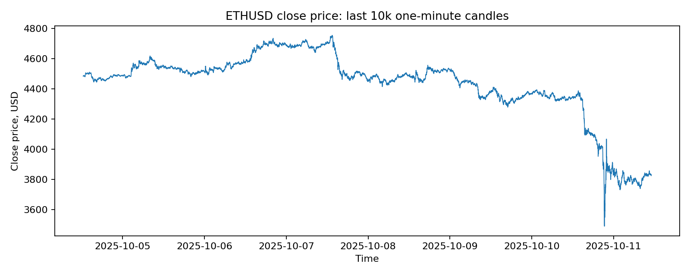
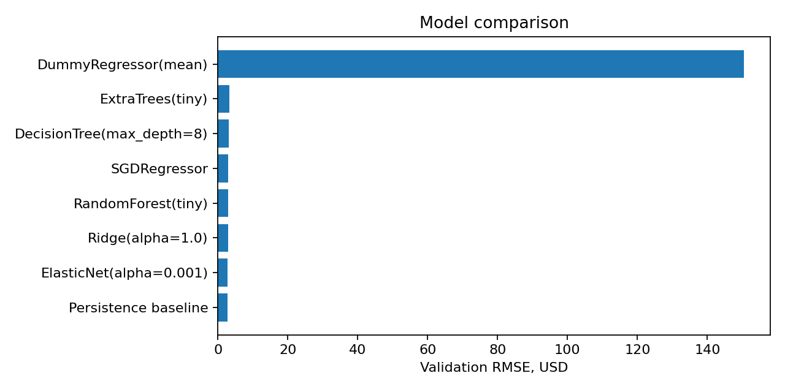
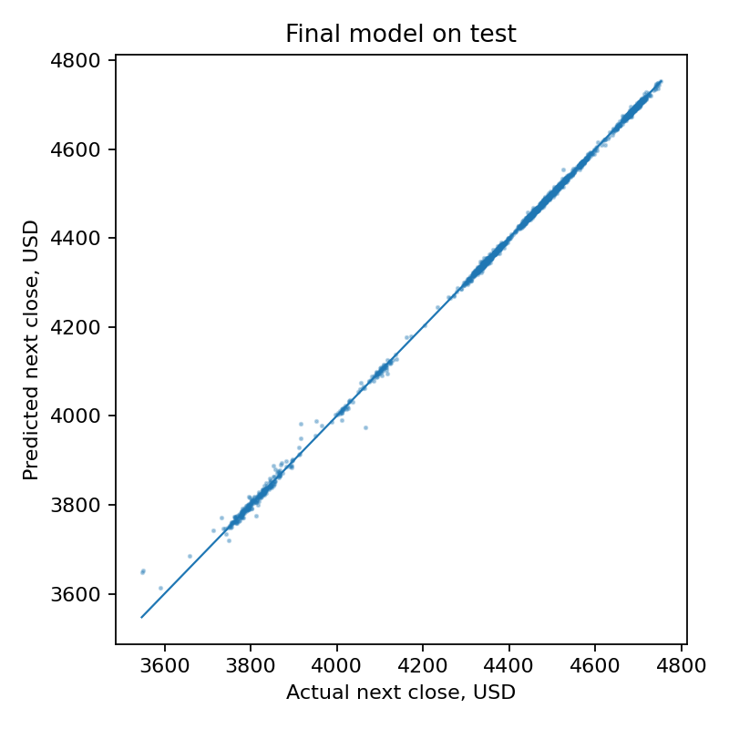
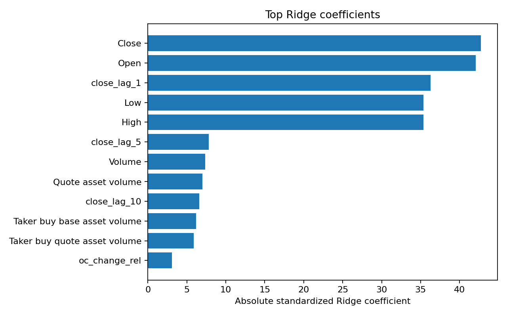
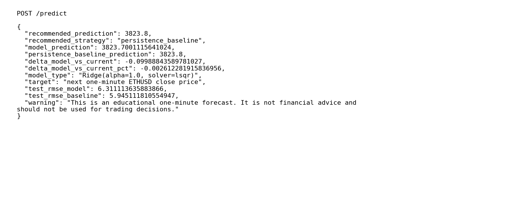
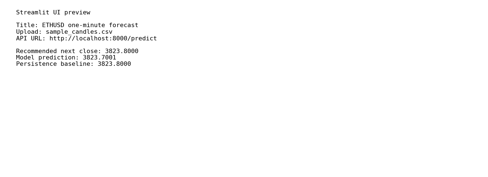

# CP3 отчёт: прогнозирование цены ETHUSD

Студент: Семён  
Проект: прогнозирование следующей минутной цены закрытия ETHUSD по минутным свечам Binance  
Версия отчёта: CP3

## 1. Введение и постановка задачи

Задача проекта — построить сервис, который по последним минутным свечам ETHUSD выдаёт прогноз цены закрытия следующей минуты. Это регрессионная ML-задача: таргет — `Close` следующей свечи.

Основная метрика — RMSE в долларах. Она выбрана потому, что ошибка измеряется в тех же единицах, что и цена, а крупные промахи штрафуются сильнее. Дополнительно считаются MAE, MAPE и directional accuracy. Directional accuracy оставлена как вспомогательная метрика: для возможного торгового применения важно направление, но в этом проекте я не заявляю торговую стратегию.

## 2. Поиск и описание данных

Использован файл `ETHUSD_1m_Binance.csv` из архива `ETHUSD_1m_Binance.zip`. Это минутные OHLCV-свечи по ETHUSD.

Краткое описание данных:

- строк всего: 4,278,673;
- столбцов: 12;
- период: 2017-08-17 04:00:00 — 2025-10-11 11:04:00;
- исходные признаки: Open, High, Low, Close, Volume, Quote asset volume, Number of trades, taker-buy объёмы и время свечи.

Для быстрого контрольного пересчёта CP3 использован последний срез в 50,000 строк: 2025-09-06 17:45:00 — 2025-10-11 11:04:00. Это не замена полного CP2-обучения, а воспроизводимая проверка для деплоя и отчёта.

## 3. Обработка и подготовка данных

Что сделано:

- даты приведены к `datetime`;
- числовые колонки приведены к числовому типу;
- в проверочном срезе пропусков не найдено;
- в проверочном срезе дублей не найдено;
- колонка `Ignore` не используется;
- сплит сделан строго по времени: train/validation/test = 70/15/15, без перемешивания.

Feature engineering:

- лаги цены закрытия: 1, 5, 10, 30, 60 минут;
- лаги минутной доходности;
- относительный спред High-Low;
- изменение Close относительно Open;
- логарифмы объёма, quote volume и числа сделок;
- доли taker-buy объёмов;
- rolling mean и rolling std на окнах 5, 15 и 60 минут;
- циклические признаки часа: `hour_sin`, `hour_cos`.

Всего в деплойном артефакте используется 35 признаков.



## 4. Baseline-модель

Главный baseline — persistence: прогноз следующего `Close` равен текущему `Close`. Для минутных финансовых данных это очень сильная проверка, потому что цена за одну минуту часто меняется мало.

На validation persistence-baseline показал лучший RMSE: 2.8433 USD. Это важный результат: сложная модель не должна считаться полезной, если она не обгоняет такой простой baseline.

## 5. Эксперименты

Каждый эксперимент проверялся одинаково: обучение на train-части, оценка на validation-части, без перемешивания времени.

| Гипотеза | Как проверялось | Результат |
|---|---|---|
| Простое сохранение текущей цены может быть сильным baseline | Persistence: next close = current close | Лучший RMSE на validation: 2.8433 |
| Линейная модель должна хорошо работать из-за высокой автокорреляции цены | Ridge/ElasticNet по лагам, OHLCV и rolling-признакам | Близко к baseline, но хуже по RMSE |
| Деревья могут поймать нелинейности | DecisionTree | Хуже линейных моделей |
| Ансамбли деревьев могут улучшить качество | RandomForest/ExtraTrees в лёгкой конфигурации | Не обогнали baseline и Ridge |
| Directional accuracy может показать пригодность для направления | Сравнение знака изменения цены | Около 50%, то есть надёжного сигнала направления нет |

Метрики экспериментов:

| model                     |      MAE |     RMSE |   MAPE_% |      R2 |   direction_accuracy_% |   fit_seconds |
|:--------------------------|---------:|---------:|---------:|--------:|-----------------------:|--------------:|
| Persistence baseline      |   1.9549 |   2.8433 |   0.044  |  0.9993 |                   1.11 |          0    |
| ElasticNet(alpha=0.001)   |   1.9631 |   2.8535 |   0.0442 |  0.9993 |                  49.59 |          0.24 |
| Ridge(alpha=1.0)          |   1.9762 |   2.869  |   0.0445 |  0.9993 |                  50.55 |          0.09 |
| RandomForest(tiny)        |   2.0806 |   2.9602 |   0.0469 |  0.9992 |                  48.67 |          2.44 |
| SGDRegressor              |   2.0901 |   3.0192 |   0.0471 |  0.9992 |                  50.19 |          0.13 |
| DecisionTree(max_depth=8) |   2.1935 |   3.0593 |   0.0494 |  0.9992 |                  49.35 |          0.85 |
| ExtraTrees(tiny)          |   2.2219 |   3.3189 |   0.05   |  0.999  |                  49.81 |          0.3  |
| DummyRegressor(mean)      | 135.982  | 150.462  |   3.0448 | -1.0487 |                  49.6  |          0.08 |



## 6. Финальная модель и интерпретируемость

Для деплоя сохранён артефакт `models/final_model.joblib` с Ridge-моделью. Причина выбора для сервиса: модель быстрая, стабильная, интерпретируемая и не создаёт тяжёлую зависимость для локального запуска.

Но честный итог такой: на тестовом срезе persistence-baseline оказался лучше по RMSE, чем Ridge:

- Ridge test RMSE: 6.3111;
- persistence test RMSE: 5.9451.

Поэтому API возвращает оба значения и поле `recommended_strategy`. В текущем артефакте рекомендация — `persistence_baseline`, потому что она честно лучше на тестовом RMSE. Ridge оставлен как ML-модель для демонстрации пайплайна и интерпретации.



Интерпретация Ridge по модулю стандартизованных коэффициентов показывает, что основной вклад дают текущие и лаговые цены (`Close`, `Open`, `close_lag_1`, `High`, `Low`). Это ожидаемо для прогноза следующей минутной цены: модель в основном экстраполирует текущий уровень цены.



## 7. Деплой

В CP3 добавлен локальный деплой:

- FastAPI: обязательный HTTP-интерфейс для запросов;
- Streamlit: простой UI для загрузки CSV и получения прогноза;
- Dockerfile и docker-compose.yml;
- пример payload: `examples/sample_payload.json`;
- тесты smoke-level: `pytest`.

Основные endpoints:

- `GET /health` — проверка, что сервис жив;
- `GET /model-info` — информация о модели и метриках;
- `POST /predict` — прогноз по последним свечам.

Команды запуска:

```bash
pip install -r requirements.txt
PYTHONPATH=src uvicorn app.main:app --reload
```

Или через Docker:

```bash
docker compose up --build
```

Скриншоты работы:






Ссылка на видео работы деплоя: https://docs.google.com/document/d/1f9FHJkqWc-Gjq2IA6QNhHMHyM5TMFY9dsiKmoqzNsXY/edit?usp=sharing

## 8. Заключение и выводы

На CP3 подготовлен деплой и отчёт. Самый важный вывод по моделированию: для минутного прогноза цены ETHUSD простой persistence-baseline очень силён. Ridge и другие модели на контрольном срезе не дали честного улучшения по RMSE. Поэтому текущий сервис не стоит воспринимать как торговый инструмент: он демонстрирует воспроизводимый ML/deployment pipeline и честно возвращает baseline как рекомендуемый прогноз, если он лучше модели.

Что можно улучшить дальше:

- прогнозировать не цену, а доходность или направление;
- увеличить горизонт прогноза, например 5/15/60 минут;
- добавить внешние признаки: funding, order book, BTC price, volatility index;
- обучать и валидировать модель walk-forward способом;
- сравнить результат с полноценным CP2-артефактом, если он уже сохранён в репозитории.
